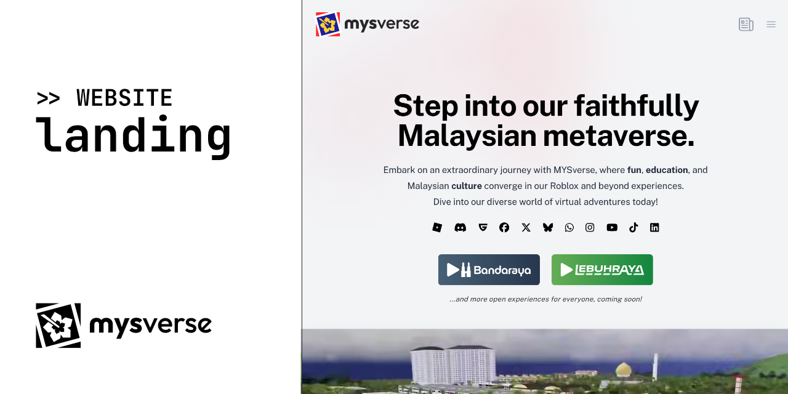

# mysverse/landing



## Overview

The **MYSverse Landing Page** is a **Next.js-based** web application that serves as the entry point to the MYSverse ecosystem. MYSverse is a Malaysian metaverse project and roleplay community that combines fun, education, and culture through immersive virtual experiences. This landing page highlights the various projects, blogs, and contact options for MYSverse, providing users with a gateway to explore its offerings.

## Features

### Dynamic Blog System

- Displays blog posts from the real-world MYSverse blog and the in-universe National Wire Service (NWS).
- Supports metadata generation for SEO and social sharing.

### Interactive Components

- Includes animated blog post cards, project showcases, and contact forms.
- Features a breadcrumb navigation system for blog posts.

### Responsive Design

- Optimized for various screen sizes, ensuring a seamless experience across devices.

### Analytics Integration

- Tracks user interactions using **Plausible Analytics**.

### Customizable Metadata

- Dynamically generates metadata for SEO and social sharing.

### Project Highlights

- Showcases MYSverse projects, including roleplay experiences on Roblox.

### Contact Options

- Provides multiple ways to get in touch, including email, phone, WhatsApp, and social media links.

---

## Technologies Used

- **Framework:** Next.js
- **Styling:** Tailwind CSS
- **Analytics:** Plausible Analytics
- **Icons:** FontAwesome and Heroicons
- **Image Handling:** Next.js Image component
- **Dynamic Imports:** Used for performance optimization

---

## Project Structure

### Key Files and Directories

- `_components`: Contains reusable UI components like `BlogPostCard`, `Header`, and `VideoPlayer`.
- `blog`: Handles blog-related pages and dynamic routing for blog types and slugs.
- `app/layout.tsx`: Defines the root layout, including metadata and global styles.
- `app/page.tsx`: The main landing page, showcasing projects, blogs, and contact options.
- `public`: Static assets like images and icons.
- `styles`: Global CSS and styling files.
- `utils`: Utility functions for fetching data and other reusable logic.

---

## Getting Started

### Prerequisites

Ensure you have the following installed:

- Node.js (version 22 or higher)
- [pnpm](https://pnpm.io/)

### Installation

Clone the repository:

```bash
git clone https://github.com/mysverse/landing.git
cd landing
```

Install dependencies:

```bash
pnpm install
```

### Running the Development Server

Start the development server:

```bash
pnpm dev
```

Open [http://localhost:3000](http://localhost:3000) in your browser to view the site.

### Building for Production

To build the project for production:

```bash
pnpm build
```

After building, you can start the production server:

```bash
pnpm start
```

## License

This project is licensed under the MIT License.
