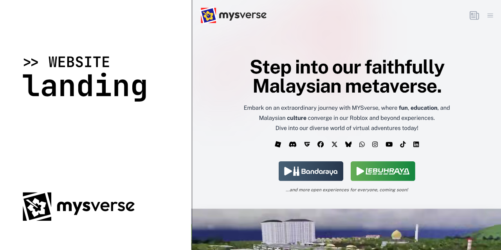

# mysverse/landing



## Overview

The **MYSverse Landing Page** is a **Next.js-based** web application that serves as the entry point to the MYSverse ecosystem. MYSverse is a Malaysian metaverse project and roleplay community that combines fun, education, and culture through immersive virtual experiences. This landing page highlights the various projects, blogs, and contact options for MYSverse, providing users with a gateway to explore its offerings.

## Features

### Ask MYSverse

The multilingual Ask MYSverse assistant is hosted by this app as a full page and a shared iframe widget for the landing site and MYSverse Wiki. It uses server-side OpenAI Responses, File Search, moderation, Turnstile, and expiring Upstash quotas. See [the assistant runbook](./docs/assistant-runbook.md) for configuration, knowledge sync, privacy, rollout, and recovery.

### Dynamic Blog System

- Displays blog posts from the real-world MYSverse blog and the in-universe National Wire Service (NWS).
- Supports metadata generation for SEO and social sharing.

### Interactive Components

- Includes animated blog post cards, project showcases, and contact forms.
- Features a breadcrumb navigation system for blog posts.

### Responsive Design

- Optimized for various screen sizes, ensuring a seamless experience across devices.

### Analytics Integration

- Tracks user interactions using **Plausible Analytics**.

### Customizable Metadata

- Dynamically generates metadata for SEO and social sharing.

### Project Highlights

- Showcases MYSverse projects, including roleplay experiences on Roblox.

### Contact Options

- Provides multiple ways to get in touch, including email, phone, WhatsApp, and social media links.

---

## Technologies Used

- **Framework:** Next.js
- **Styling:** Tailwind CSS
- **Analytics:** Plausible Analytics
- **Icons:** FontAwesome and Heroicons
- **Image Handling:** Next.js Image component
- **Dynamic Imports:** Used for performance optimization

---

## Project Structure

### Key Files and Directories

- `_components`: Contains reusable UI components like `BlogPostCard`, `Header`, and `VideoPlayer`.
- `blog`: Handles blog-related pages and dynamic routing for blog types and slugs.
- `app/layout.tsx`: Defines the root layout, including metadata and global styles.
- `app/page.tsx`: The main landing page, showcasing projects, blogs, and contact options.
- `public`: Static assets like images and icons.
- `styles`: Global CSS and styling files.
- `utils`: Utility functions for fetching data and other reusable logic.

---

## Getting Started

### Prerequisites

Ensure you have the following installed:

- Node.js (version 22 or higher)
- [pnpm](https://pnpm.io/)

### Installation

Clone the repository:

```bash
git clone https://github.com/mysverse/landing.git
cd landing
```

Install dependencies:

```bash
pnpm install
```

### Running the Development Server

Start the development server:

```bash
pnpm dev
```

Open [http://localhost:3000](http://localhost:3000) in your browser to view the site.

### Building for Production

To build the project for production:

```bash
pnpm build
```

After building, you can start the production server:

```bash
pnpm start
```

## Visual & accessibility testing

A Playwright harness (`tests/`) verifies the production build across
light mode, dark mode, and mobile — the axes most likely to regress
visually. It always runs with `prefers-reduced-motion: reduce`, which
both stabilises screenshots and exercises the site's reduced-motion
paths.

```bash
pnpm build:test     # the harness serves this production build on :4300
pnpm screenshots    # refresh baselines + write a gallery to screenshots/
pnpm test:visual    # diff pages against tests/__screenshots__/
pnpm test:e2e       # everything: visual + smoke + accessibility
pnpm exec playwright show-report   # browse results, diffs and traces
```

> Use `pnpm build:test`, not `pnpm build`. The locale layout fetches the news
> feed server-side and is statically generated, so the payload is baked into the
> prerendered HTML at *build* time — `build:test` pins it to
> `tests/fixtures/newsFixture.ts`. Building without it leaves the live feed in
> the pages, so the header's unread badge and the news deck's item count drift
> with whatever the worker is serving that day.

**Eyeballing changes:** every run writes full-page PNGs to
`screenshots/<desktop-light|desktop-dark|mobile>/`. Open that folder to
review a change visually; `pnpm test:visual` then tells you which pages
moved and by how much, with side-by-side diffs in the HTML report.

- **`tests/visual.spec.ts`** — full-page screenshots of home, contribute,
  lebuhraya, the blog index, a legal page and the 404, per theme/viewport.
  Live stat counters and videos are masked so runs are deterministic.
  Baselines live in `tests/__screenshots__/` (gitignored by default —
  commit that directory if you want CI to diff against them).
- **`tests/smoke.spec.ts`** — behaviour the design system depends on:
  skip link focus order, title template, hreflang tags, localized 404,
  dark-mode toggle persistence, system dark preference, mobile menu
  dialog + Escape, DevHub tablist arrow keys, and the news deck
  (bidirectional arrow keys, wrap-around, dots, Escape, unread badge).
- **`tests/a11y.spec.ts`** — axe-core WCAG 2.1 A/AA scans. Structural
  violations (missing link names, roles, labels) fail the build. Colour
  contrast is *reported, not enforced* — see the note at the top of that
  file: the brand red `#ed5353` on white is ~3.3:1, below the 4.5:1 AA
  threshold, which is a brand decision rather than a code fix.

Third-party calls (analytics, live metrics, video CDN) are blocked in
`tests/helpers.ts` so pages render their built-in fallbacks, and news
artwork is fulfilled there with a placeholder pixel. The news feed itself
is pinned at build time by `build:test` (see above) — it's fetched inside
the Next process, where route interception can't reach it.

> **Linux/WSL note:** Chromium needs system libraries. Run
> `pnpm exec playwright install --with-deps chromium` (needs sudo). Without
> root, fetch them into a user directory and export `LD_LIBRARY_PATH`
> before running the tests.
>
> Both dev servers bind `::` and are probed over `[::1]`. On WSL2 a connect to
> a *closed* IPv4 loopback port is dropped rather than refused, and Playwright
> always probes `webServer.url` before starting anything — over IPv4 that
> probe blocked for the full TCP timeout, ~135s per server on every run.
> Over IPv6 it's refused in about a millisecond.

## License

This project is licensed under the MIT License.
